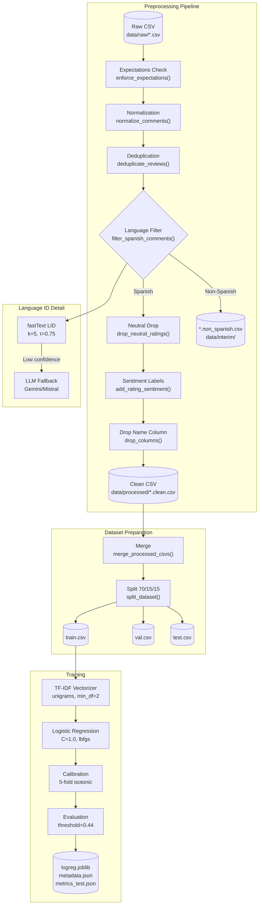
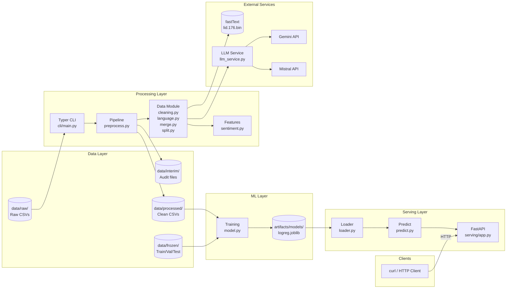

# Gym Sentiment Guard — Project Review

> Evidence-based audit for new contributors. Every claim references workspace files.

---

## Project Objective

**Source**: [CONTEXT_SUMMARY.md](file:///d:/Javier%202.0/Machine%20Learning/Gym%20Sentiment%20Guard/gym-sentiment-guard/docs/CONTEXT_SUMMARY.md), [AGENTS.md](file:///d:/Javier%202.0/Machine%20Learning/Gym%20Sentiment%20Guard/gym-sentiment-guard/AGENTS.md)

- Ingest Google Maps–style **gym reviews** (raw CSVs)
- Preprocess into **clean, Spanish-only datasets** with deterministic pipeline
- Train **classic ML sentiment classifier** (TF-IDF + Logistic Regression)
- Serve predictions via **REST API** for scheduled/on-demand inference
- Maintain **config-driven reproducibility** without code edits

**Intended Users**: ML engineers maintaining sentiment analysis for gym review monitoring

---

## Technologies Used

| Technology | Where Found | Purpose |
|------------|-------------|---------|
| Python 3.11+ | `pyproject.toml:6` | Runtime |
| pandas ≥2.1 | `pyproject.toml:8` | Data manipulation |
| scikit-learn ≥1.4 | `pyproject.toml:12` | TF-IDF, LogReg, calibration |
| fasttext-wheel ≥0.9.2 | `pyproject.toml:9` | Language identification |
| typer ≥0.12.5 | `pyproject.toml:10` | CLI framework |
| FastAPI ≥0.115 | `pyproject.toml:15` | REST API serving |
| uvicorn ≥0.30 | `pyproject.toml:16` | ASGI server |
| PyYAML ≥6.0.1 | `pyproject.toml:11` | Config parsing |
| requests ≥2.32 | `pyproject.toml:14` | LLM fallback HTTP calls |
| matplotlib ≥3.8 | `pyproject.toml:13` | Confusion matrix visualization |
| Ruff | `pyproject.toml:26-42` | Linting and formatting |
| pytest | `pyproject.toml:22-24` | Testing framework |
| joblib | `configs/logreg_v1.yaml:62` | Model serialization |

---

## Repo Map

### Root Files
| File | Purpose |
|------|---------|
| `pyproject.toml` | Package metadata, dependencies, tool configs |
| `README.md` | User documentation, CLI usage examples |
| `AGENTS.md` | AI agent guidelines, architecture, workflow rules |
| `CODEOWNERS` | Code ownership definitions |
| `CONTRIBUTING.md` | Contribution guidelines |
| `DA.ipynb` | Skipped (large notebook, 420KB) |

### `configs/`
| File | Purpose |
|------|---------|
| `preprocess.yaml` | Preprocessing pipeline configuration |
| `logreg_v1.yaml` | Model training hyperparameters and paths |
| `serving.yaml` | Serving API configuration |
| `structural_punctuation.txt` | Punctuation pattern for normalization |

### `src/gym_sentiment_guard/`
| Module | Purpose |
|--------|---------|
| `cli/main.py` | Typer CLI with 7 commands |
| `config/preprocess.py` | Config dataclasses for preprocessing |
| `config/serving.py` | Config dataclasses for serving |
| `data/cleaning.py` | Text normalization, dedup, neutral drop |
| `data/language.py` | fastText LID + LLM fallback logic |
| `data/merge.py` | Dataset merging with schema validation |
| `data/split.py` | Stratified train/val/test splitting |
| `features/sentiment.py` | Rating → sentiment label derivation |
| `io/files.py` | Path utilities, pending file detection |
| `pipeline/preprocess.py` | Orchestrates preprocessing stages |
| `training/model.py` | Config-driven model training |
| `serving/app.py` | FastAPI application |
| `serving/loader.py` | Model loading utilities |
| `serving/schemas.py` | Pydantic request/response models |
| `serving/predict.py` | Preprocessing + prediction logic |
| `utils/logging.py` | Structured JSON logging |

### `scripts/`
| Script | Purpose |
|--------|---------|
| `llm_service.py` | FastAPI proxy for Gemini/Mistral LLM fallback |
| `eval_fasttext_lid.py` | LID accuracy/F1 evaluation |
| `tag_ground_truth_languages.py` | Language annotation for eval data |
| `merge_language_datasets.py` | Merge per-language folders |
| `sample_language_reviews.py` | Balanced sampling for eval |
| `merge_sampled_languages.py` | Final merge for evaluation |
| `process_pending_csvs.py` | Legacy wrapper for batch preprocess |
| `merge_processed_datasets.py` | Helper for merging processed files |
| `remove_neutral_from_merged.py` | Neutral review removal utility |

### `tests/`
| Directory | Contents |
|-----------|----------|
| `unit/` | 15 test files covering cleaning, language, pipeline, serving |
| `integration/` | 1 test file for serving API endpoints |

### `artifacts/`
| Directory | Contents |
|-----------|----------|
| `models/sentiment_logreg/` | 2 versioned model runs (`model.2025.12.16_00{1,2}`) |
| `external/` | fastText LID model (`lid.176.bin`) - binary, skipped |
| `datasets/` | Not found in workspace listing |

---

## Functionality Inventory

### Implemented (verified in code)

| Feature | Evidence |
|---------|----------|
| **Preprocessing pipeline** | `pipeline/preprocess.py`, `cli/main.py:preprocess` |
| **Batch preprocessing** | `cli/main.py:preprocess_batch` |
| **Language filtering** (fastText + LLM fallback) | `data/language.py` |
| **Text normalization** | `data/cleaning.py:normalize_comments` |
| **Deduplication** | `data/cleaning.py:deduplicate_reviews` |
| **Neutral rating removal** | `data/cleaning.py:drop_neutral_ratings` |
| **Sentiment label derivation** | `features/sentiment.py:add_rating_sentiment` |
| **Dataset merging** | `data/merge.py`, `cli/main.py:merge_processed` |
| **Stratified splitting** | `data/split.py`, `cli/main.py:split_data` |
| **Model training** (TF-IDF + CalibratedLogReg) | `training/model.py:train_from_config` |
| **Serving API** (5 endpoints) | `serving/app.py` |
| **LLM fallback service** | `scripts/llm_service.py` |
| **LID evaluation** | `scripts/eval_fasttext_lid.py` |
| **Unit tests** (51 passing) | 16 files in `tests/` |

### Planned/Referenced (not yet implemented)

| Feature | Reference |
|---------|-----------|
| Docker containerization | `CONTEXT_SUMMARY.md:106` ("Phase 2") |
| Cloud Run deployment | `CONTEXT_SUMMARY.md:106` ("Phase 3") |
| CI/CD pipeline | `CONTEXT_SUMMARY.md:106` ("Phase 4"), `AGENTS.md:380-386` |
| SVM model alternative | `AGENTS.md:391` (mentioned as config switch) |
| Makefile automation | `AGENTS.md:109-132` (template provided, not found in workspace) |

---

## Current State

### How to Run

**Install**:
```bash
python -m venv .venv && .venv\Scripts\activate
pip install -e .
```

**Preprocess single CSV**:
```bash
python -m gym_sentiment_guard.cli.main main preprocess \
  --input data/raw/reviews.csv --config configs/preprocess.yaml
```

**Train model**:
```bash
python -m gym_sentiment_guard.cli.main main train-model \
  --config configs/logreg_v1.yaml
```

**Serve API**:
```bash
uvicorn gym_sentiment_guard.serving.app:app --port 8001
```

### Key Configurations

| Config | Key Settings |
|--------|--------------|
| `preprocess.yaml` | LID threshold=0.75, fallback=enabled, dedup on (comment,rating,name) |
| `logreg_v1.yaml` | C=1.0, 5-fold isotonic calibration, threshold=0.44 on negative |
| `serving.yaml` | Port 8001, 50KB max text, 100 batch max |

### Model Artifacts (verified)

| Path | Contents |
|------|----------|
| `artifacts/models/sentiment_logreg/model.2025.12.16_002/` | `logreg.joblib`, `metadata.json`, `metrics_test.json` |

### Known Gaps / Risks

| Gap | Evidence |
|-----|----------|
| No Dockerfile | Not found in workspace |
| No CI/CD workflow | `.github/` exists but contents not verified |
| Makefile missing | Referenced in `AGENTS.md` but not found |
| Data directory assumptions | Raw CSVs expected in `data/raw/` |
| LLM fallback requires running service | `scripts/llm_service.py` must be started separately |

---

## Diagram 1: Preprocessing + Training Pipeline



---

## Diagram 2: System Architecture



---

## Evidence Appendix

### Most Important Files

| File | Why It Matters |
|------|----------------|
| [CONTEXT_SUMMARY.md](file:///d:/Javier%202.0/Machine%20Learning/Gym%20Sentiment%20Guard/gym-sentiment-guard/docs/CONTEXT_SUMMARY.md) | Source of truth for project intent and current status |
| [AGENTS.md](file:///d:/Javier%202.0/Machine%20Learning/Gym%20Sentiment%20Guard/gym-sentiment-guard/AGENTS.md) | Architecture, conventions, workflow rules |
| [cli/main.py](file:///d:/Javier%202.0/Machine%20Learning/Gym%20Sentiment%20Guard/gym-sentiment-guard/src/gym_sentiment_guard/cli/main.py) | Entry point for all 7 CLI commands |
| [pipeline/preprocess.py](file:///d:/Javier%202.0/Machine%20Learning/Gym%20Sentiment%20Guard/gym-sentiment-guard/src/gym_sentiment_guard/pipeline/preprocess.py) | Orchestrates preprocessing stages |
| [data/language.py](file:///d:/Javier%202.0/Machine%20Learning/Gym%20Sentiment%20Guard/gym-sentiment-guard/src/gym_sentiment_guard/data/language.py) | fastText LID + LLM fallback implementation |
| [training/model.py](file:///d:/Javier%202.0/Machine%20Learning/Gym%20Sentiment%20Guard/gym-sentiment-guard/src/gym_sentiment_guard/training/model.py) | Config-driven model training logic |
| [serving/app.py](file:///d:/Javier%202.0/Machine%20Learning/Gym%20Sentiment%20Guard/gym-sentiment-guard/src/gym_sentiment_guard/serving/app.py) | FastAPI application with all endpoints |
| [configs/preprocess.yaml](file:///d:/Javier%202.0/Machine%20Learning/Gym%20Sentiment%20Guard/gym-sentiment-guard/configs/preprocess.yaml) | Preprocessing configuration |
| [configs/logreg_v1.yaml](file:///d:/Javier%202.0/Machine%20Learning/Gym%20Sentiment%20Guard/gym-sentiment-guard/configs/logreg_v1.yaml) | Model training hyperparameters |
| [pyproject.toml](file:///d:/Javier%202.0/Machine%20Learning/Gym%20Sentiment%20Guard/gym-sentiment-guard/pyproject.toml) | Dependencies and tool configurations |

---

*Generated: 2025-12-16 | Audit based solely on workspace file contents*
