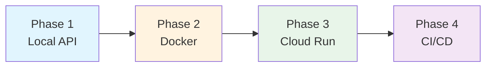

# Serving Module Implementation Plan

## Goal

Deploy the trained logistic regression sentiment model via FastAPI, following a phased approach from local development to Google Cloud Run production deployment.

---

## Phased Approach Overview



| Phase | Deliverables | Skills Learned |
|-------|--------------|----------------|
| **Phase 1** | FastAPI app, tests, local server | API design, Pydantic, model loading |
| **Phase 2** | Dockerfile, docker-compose | Containerization, reproducibility |
| **Phase 3** | Cloud Run deployment | GCP, Artifact Registry, scaling |
| **Phase 4** | GitHub Actions workflow | CI/CD, automated deployment |

---

# Phase 1: Local API (Current Focus)

## Technical Decision Points

> [!IMPORTANT]
> **The following decisions require your input before implementation.**

---

### Decision 1: Model Loading Strategy

**Context**: How should the API locate and load the trained model?

| Option | Description | Pros | Cons |
|--------|-------------|------|------|
| **A) Environment Variable** | `MODEL_PATH` env var pointing to model directory | Simple, 12-factor app compliant, easy to override per environment | Requires setting env var; no fallback discovery |
| **B) Config File** | `configs/serving.yaml` with `model.path` | Consistent with project's YAML config pattern; version-controlled defaults | Extra file to maintain; less flexible for dynamic paths |
| **C) Auto-Discovery** | Scan `artifacts/models/` and load latest version by date | Zero-config experience; always serves newest model | Implicit behavior; harder to pin specific version; potential surprises |
| **D) Hybrid (Recommended)** | Env var → Config file → Auto-discovery (fallback chain) | Best of all worlds; explicit when needed, convenient by default | Slightly more complex logic |

**Your choice?** ___

---

### Decision 2: Response Schema Design

**Context**: What information should the API return for each prediction?

| Option | Description | Pros | Cons |
|--------|-------------|------|------|
| **A) Minimal** | `{sentiment, confidence}` | Simple, small payload, easy to consume | Less debugging info; clients can't verify model version |
| **B) Full Probabilities** | `{sentiment, confidence, prob_positive, prob_negative, model_version}` | Complete info for debugging; clients know model version | Larger payload; exposes internal details |
| **C) Configurable** | Query param `?verbose=true` toggles extra fields | Flexibility; minimal by default | More complex implementation; testing overhead |

**Your choice?** ___

---

### Decision 3: Text Preprocessing at Inference

**Context**: Should the API apply the same preprocessing (lowercase, punctuation removal) used during training?

| Option | Description | Pros | Cons |
|--------|-------------|------|------|
| **A) Yes, Apply Preprocessing** | Reuse `normalize_comments` logic | Consistency with training; better predictions | Coupling with data module; preprocessing errors affect API |
| **B) No, Raw Input** | Pass text directly to model (TF-IDF handles lowercase internally) | Simpler; TF-IDF already lowercases | May miss edge cases that preprocessing handles |
| **C) Configurable Toggle** | Config option to enable/disable preprocessing | Flexibility for A/B testing different pipelines | More complexity; unclear default behavior |

**Note**: Your TF-IDF was trained with `lowercase=true`, so it lowercases automatically. But structural punctuation removal was done pre-TF-IDF during training.

**Your choice?** ___

---

### Decision 4: Error Handling Philosophy

**Context**: How should the API handle invalid inputs or processing errors?

| Option | Description | Pros | Cons |
|--------|-------------|------|------|
| **A) Strict Validation** | Reject empty strings, non-string types, texts > 10KB with 400 errors | Clear contract; prevents abuse; fails fast | May reject legitimate edge cases |
| **B) Lenient Processing** | Accept anything, return `null` sentiment for unpredictable inputs | Always responds; never breaks client | May mask bugs; harder to debug |
| **C) Graceful Degradation** | Return prediction with `warning` field for edge cases | Best UX; informative; still serves predictions | More complex response schema |

**Your choice?** ___

---

### Decision 5: Logging Approach

**Context**: What level of logging detail for serving?

| Option | Description | Pros | Cons |
|--------|-------------|------|------|
| **A) Minimal** | Log only errors and startup | Low noise; minimal performance impact | Hard to debug production issues |
| **B) Request Summary** | Log each request: latency, input length, prediction | Great observability; useful metrics | Higher I/O; privacy concerns if logging text |
| **C) Full Debug Mode** | Log input text, preprocessing steps, raw probabilities | Complete debugging info | Privacy risk; high volume; never for prod |

**Note**: Option B can be made configurable via environment variable (e.g., `GSG_LOG_REQUESTS=1`).

**Your choice?** ___

---

### Decision 6: Batch Prediction Limits

**Context**: What limits should apply to batch predictions?

| Option | Max Items | Max Text Length | Rationale |
|--------|-----------|-----------------|-----------|
| **A) Conservative** | 10 texts | 2KB each | Fast response; low memory; predictable |
| **B) Moderate** | 100 texts | 5KB each | Good throughput; reasonable for most use cases |
| **C) Generous** | 500 texts | 10KB each | High throughput; but slower/memory-intensive |

**Your choice?** ___

---

## Granular Task Breakdown (Phase 1)

Once decisions are made, here are the implementation tasks:

### 1. Project Setup
- [ ] 1.1 Create `src/gym_sentiment_guard/serving/__init__.py` with module docstring
- [ ] 1.2 Add serving dependencies to `pyproject.toml` (if any new ones needed)
- [ ] 1.3 Create `configs/serving.yaml` with chosen configuration

### 2. Model Loading Module
- [ ] 2.1 Create `serving/loader.py` with `ModelArtifact` dataclass
- [ ] 2.2 Implement `load_model(path: Path)` function
- [ ] 2.3 Implement model discovery logic (based on Decision 1)
- [ ] 2.4 Add error handling for missing/corrupted model files
- [ ] 2.5 Write unit tests for loader (`tests/unit/test_serving_loader.py`)

### 3. Request/Response Schemas
- [ ] 3.1 Create `serving/schemas.py` with Pydantic models
- [ ] 3.2 Define `PredictRequest` with validation rules
- [ ] 3.3 Define `PredictResponse` (based on Decision 2)
- [ ] 3.4 Define `BatchPredictRequest` and `BatchPredictResponse`
- [ ] 3.5 Define `HealthResponse` and `ModelInfoResponse`

### 4. Core Prediction Logic
- [ ] 4.1 Create `serving/predict.py` with prediction function
- [ ] 4.2 Implement text preprocessing (based on Decision 3)
- [ ] 4.3 Implement threshold-based classification using model metadata
- [ ] 4.4 Add error handling (based on Decision 4)
- [ ] 4.5 Write unit tests for prediction logic

### 5. FastAPI Application
- [ ] 5.1 Create `serving/app.py` with FastAPI instance
- [ ] 5.2 Implement startup event for model loading
- [ ] 5.3 Implement `POST /predict` endpoint
- [ ] 5.4 Implement `POST /predict/batch` endpoint
- [ ] 5.5 Implement `GET /health` endpoint
- [ ] 5.6 Implement `GET /ready` endpoint
- [ ] 5.7 Implement `GET /model/info` endpoint
- [ ] 5.8 Add structured logging (based on Decision 5)
- [ ] 5.9 Configure CORS if needed for web clients

### 6. Testing
- [ ] 6.1 Create `tests/unit/test_serving_schemas.py`
- [ ] 6.2 Create `tests/unit/test_serving_predict.py`
- [ ] 6.3 Create `tests/integration/test_serving_api.py` with TestClient
- [ ] 6.4 Add edge case tests (empty text, long text, special chars)
- [ ] 6.5 Add batch endpoint tests with limit validation

### 7. Documentation
- [ ] 7.1 Add docstrings to all public functions
- [ ] 7.2 Update `README.md` with serving section
- [ ] 7.3 Update `docs/CONTEXT_SUMMARY.md`

### 8. Verification
- [ ] 8.1 Run `ruff check src/gym_sentiment_guard/serving/`
- [ ] 8.2 Run `ruff format src/gym_sentiment_guard/serving/`
- [ ] 8.3 Run `pytest tests/ -v`
- [ ] 8.4 Manual testing with curl commands

---

## File Structure After Phase 1

```
src/gym_sentiment_guard/serving/
├── __init__.py          # Module exports
├── app.py               # FastAPI application
├── loader.py            # Model loading utilities
├── predict.py           # Prediction logic
└── schemas.py           # Pydantic request/response models

configs/
└── serving.yaml         # Serving configuration

tests/
├── unit/
│   ├── test_serving_loader.py
│   ├── test_serving_schemas.py
│   └── test_serving_predict.py
└── integration/
    └── test_serving_api.py
```

---

## Future Phases (Preview)

### Phase 2: Docker Containerization
- Multi-stage Dockerfile (builder + runner)
- Slim Python base image for reduced cold start
- Model artifacts copied into container
- docker-compose for local testing

### Phase 3: Cloud Run Deployment
- Push to Google Artifact Registry
- `gcloud run deploy` configuration
- Health check probe configuration
- Environment variable secrets

### Phase 4: CI/CD Pipeline
- GitHub Actions workflow
- Automated testing on PR
- Deploy to Cloud Run on merge to main

---

## Next Step

**Please answer the 6 decision questions above** so I can proceed with implementation.
