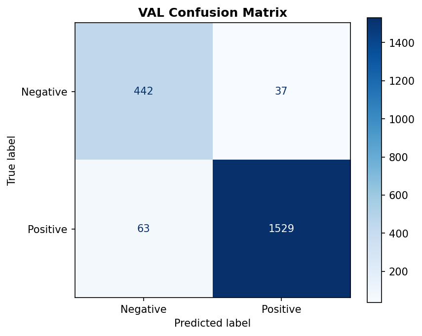

# Final Model Report — Production Readiness

## Model Summary

| Property | Value |
|----------|-------|
| **Run ID** | `run.2026-01-10_200` |
| **Threshold** | 0.3766 |
| **Model Type** | Logistic Regression + TF-IDF + Isotonic Calibration |

---

## VAL vs TEST Performance

### Negative Class (Primary Focus)

| Metric | VAL | TEST | Δ |
|--------|-----|------|---|
| F1_neg | 0.8984 | 0.9070 | +0.0087 |
| Recall_neg | 0.9228 | 0.9269 | +0.0042 |
| Precision_neg | 0.8752 | 0.8880 | +0.0128 |

> **Recall constraint on TEST**: 0.9269 ≥ 0.90 ✓

### Positive Class

| Metric | VAL | TEST | Δ |
|--------|-----|------|---|
| F1_pos | 0.9683 | 0.9712 | +0.0029 |
| Recall_pos | 0.9604 | 0.9648 | +0.0044 |
| Precision_pos | 0.9764 | 0.9777 | +0.0014 |

---

## Confusion Matrix (VAL)

---

## Precision-Recall Curve (Negative Class)

---

## Threshold Sensitivity

---

## Calibration Quality

| Metric | Value | Interpretation |
|--------|-------|----------------|
| Brier Score | 0.0377 | Excellent (lower is better, 0 = perfect) |
| ECE | 0.0096 | Excellent (lower is better) |

**What these metrics mean:**

- **Brier Score**: Measures the mean squared error between predicted probabilities and actual outcomes. A score of 0 is perfect, while 0.25 represents random guessing for binary classification. Low Brier Score indicates the model's probability estimates are accurate.

- **ECE (Expected Calibration Error)**: Measures how well predicted probabilities match observed frequencies. When ECE is low, confidence scores are reliable — e.g., predictions with 70% confidence are correct approximately 70% of the time. This is critical for trust in production systems.

---

## VAL vs TEST Comparison

---

## Model Readiness Summary

### ✅ Approved for Deployment

| Check | Status |
|-------|--------|
| Recall_neg ≥ 0.90 (VAL) | ✓ |
| Recall_neg ≥ 0.90 (TEST) | ✓ |
| F1_neg stability (VAL→TEST) | ✓ |
| Calibration quality | ✓ |

### Operational Notes

- Threshold: Use `0.3766` for production
- Monitor: Track Recall_neg in production logs
- Fallback: If Recall_neg drops below 0.85, retrain with fresher data
