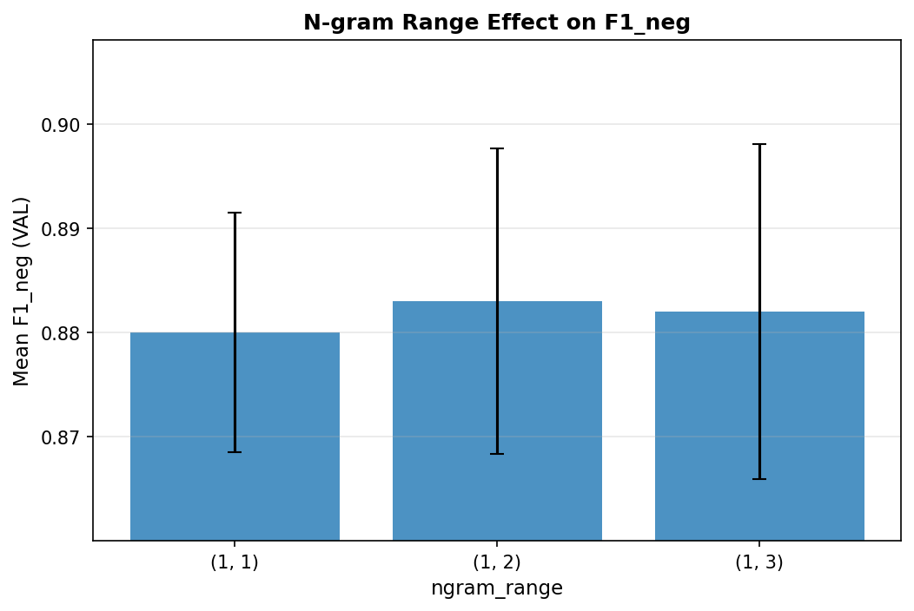

# Factor-Level Ablation Analysis

This layer analyzes **design decisions** rather than individual runs, answering:
> *"Why does the model behave the way it does?"*

---

## Regularization Strength (C)

**Conclusion**: Best mean F1_neg achieved at C=5.0. Performance varies by 0.0052 std across configurations. Model shows stability to regularization.

---

## N-gram Range

**Conclusion**: Best performance with ngram_range=(1, 2). Higher-order n-grams provide marginal improvements.

---

## Stopword Removal

**Conclusion**: Stopword removal improves F1_neg by 0.0038. Effect is marginal.

---

## Key Takeaways

1. Regularization and n-gram configuration have the largest impact on model performance.
2. Stopword handling can provide marginal improvements without significant cost.
3. The optimal configuration balances recall constraint with F1 maximization.
