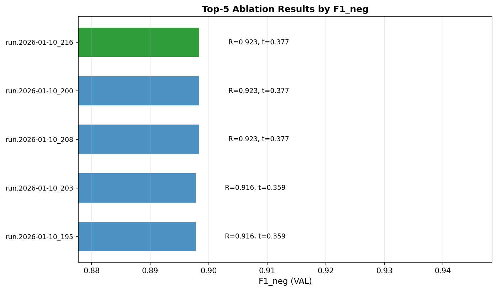

# Top-5 Ablation Results

## Winner Summary

| Metric | Value |
|--------|-------|
| **Run ID** | `run.2026-01-10_200` |
| **F1_neg (VAL)** | 0.8984 |
| **Recall_neg** | 0.9228 ≥ 0.90 ✓ |
| **Precision_neg** | 0.8752 |
| **Threshold** | 0.3766 |
| **Macro_F1** | 0.9334 |
| **PR_AUC_neg** | 0.9451 |
| **Brier Score** | 0.0377 |
| **ECE** | 0.0096 |

### Winner Hyperparameters

| Parameter | Value |
|-----------|-------|
| C | 5.0 |
| penalty | l2 |
| ngram_range | (1, 3) |
| min_df | 10 |
| max_df | 0.9 |
| sublinear_tf | True |
| stopwords_enabled | True |

---

## Top-5 Comparison

| run_id             |   F1_neg |   Recall_neg |   Macro_F1 |   PR_AUC_neg |   Brier_Score |    ECE |
|:-------------------|---------:|-------------:|-----------:|-------------:|--------------:|-------:|
| run.2026-01-10_200 |   0.8984 |       0.9228 |     0.9334 |       0.9451 |        0.0377 | 0.0096 |
| run.2026-01-10_208 |   0.8984 |       0.9228 |     0.9334 |       0.9451 |        0.0377 | 0.0096 |
| run.2026-01-10_216 |   0.8984 |       0.9228 |     0.9334 |       0.9451 |        0.0377 | 0.0096 |
| run.2026-01-10_195 |   0.8978 |       0.9165 |     0.9331 |       0.9421 |        0.0399 | 0.0142 |
| run.2026-01-10_203 |   0.8978 |       0.9165 |     0.9331 |       0.9421 |        0.0399 | 0.0142 |

---

## Conclusion

The winner `run.2026-01-10_200` was selected using the experiment protocol:

1. **Constraint satisfied**: Recall_neg = 0.9228 ≥ 0.90 ✓
2. **Primary objective**: Highest F1_neg = 0.8984 among valid runs
3. **Tie-breakers applied**: Macro_F1 → PR_AUC_neg → Brier Score → ECE

> **Note**: All comparisons use VAL metrics only. No TEST data was used for model selection.
