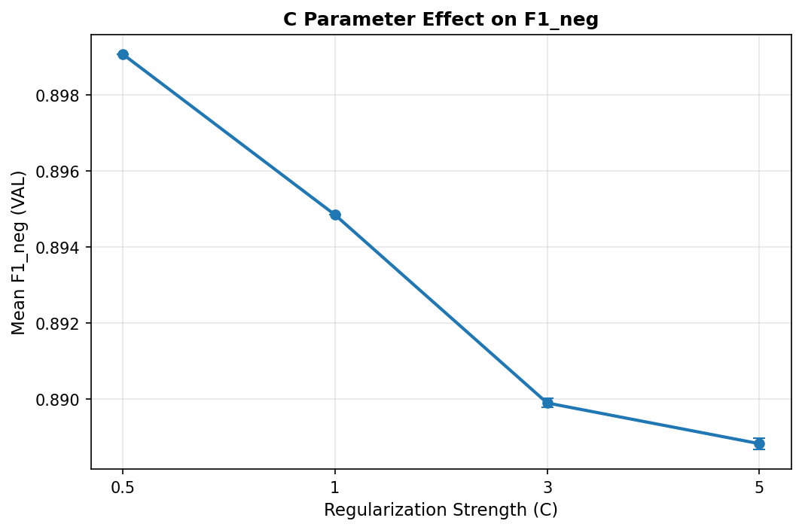
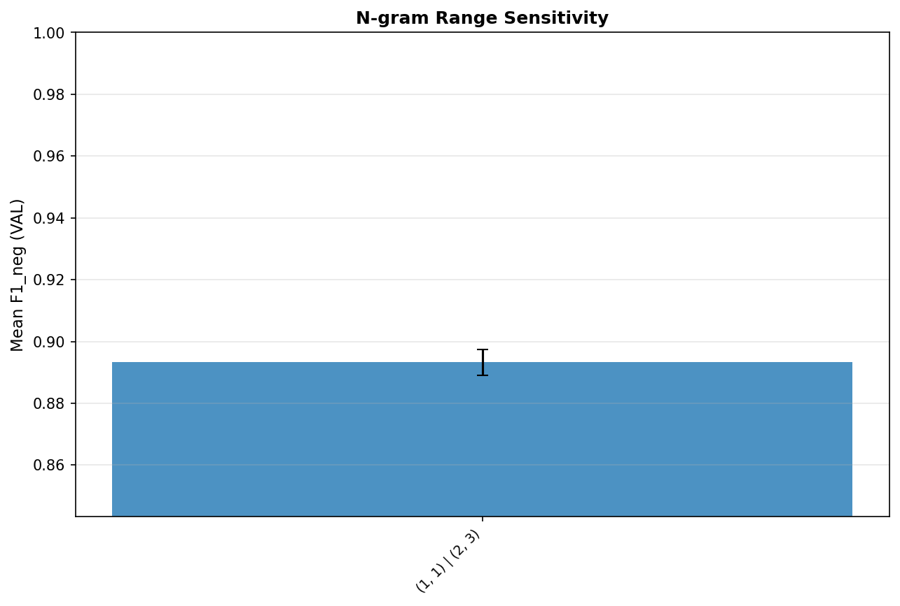
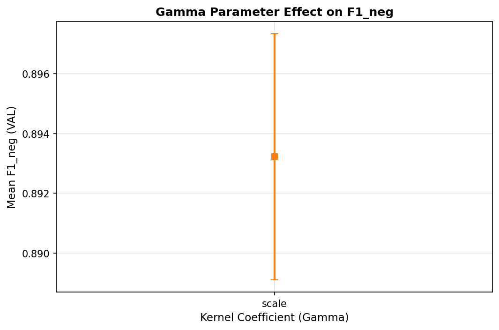
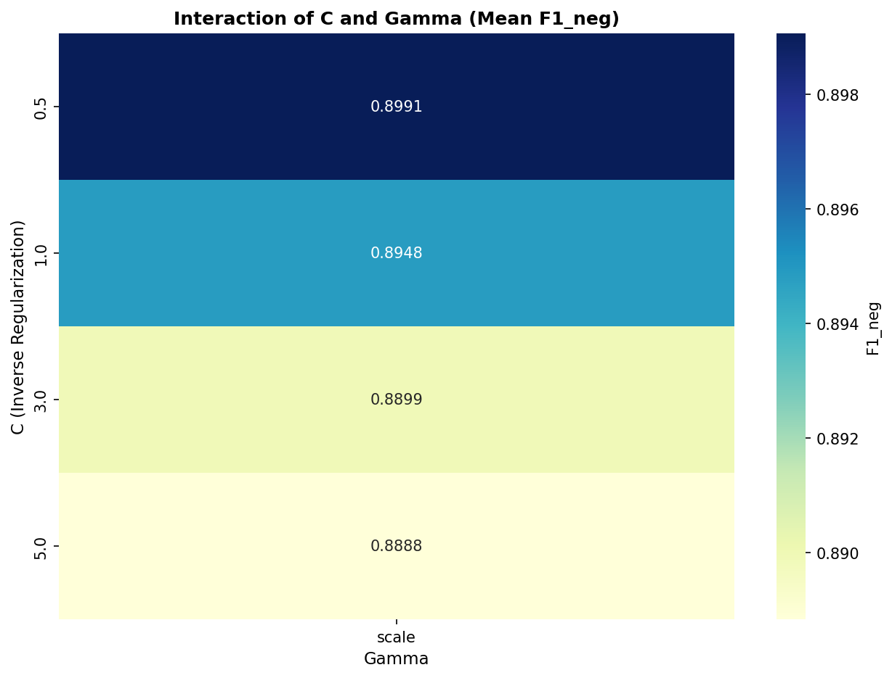
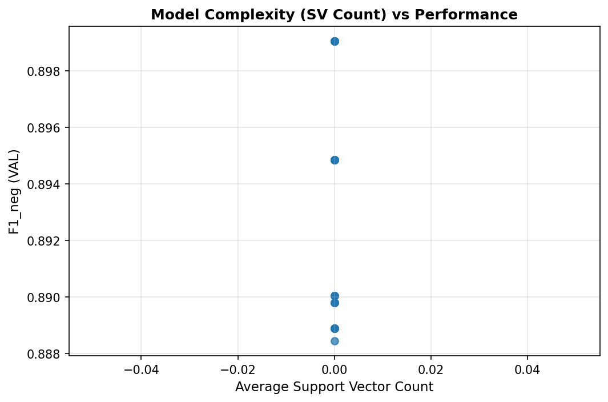

# Layer 3 — Factor-Level Ablation Analysis (SVC RBF)

This layer analyzes how individual design decisions and hyperparameters impact model performance.

## 1. Regularization Strength (C)

The model shows optimal performance around C=0.5. Higher regularization (low C) leads to underfitting, while higher C values show marginal gains or slight volatility depending on other factors.

## 2. N-Gram Range Sensitivity

Optimal feature density is achieved with `(1, 1) | (2, 3)`. The inclusion of multigram features provided consistent lift over unigrams alone.

## 3. Kernel Coefficient (Gamma)

The RBF kernel is most effective with gamma=scale. This suggests the sentiment features have a specific locality in the feature space that this kernel width captures.

## 4. Gamma & C Interaction

The interaction heatmap reveals a trade-off between C and Gamma. As C increases, the model becomes more sensitive to Gamma choice to avoid over-fitting or complex boundaries.

## 5. Model Complexity (Support Vectors)

There is a negative correlation (r=nan) between support vector count and F1_neg. More support vectors generally improve performance until a saturation point is reached.