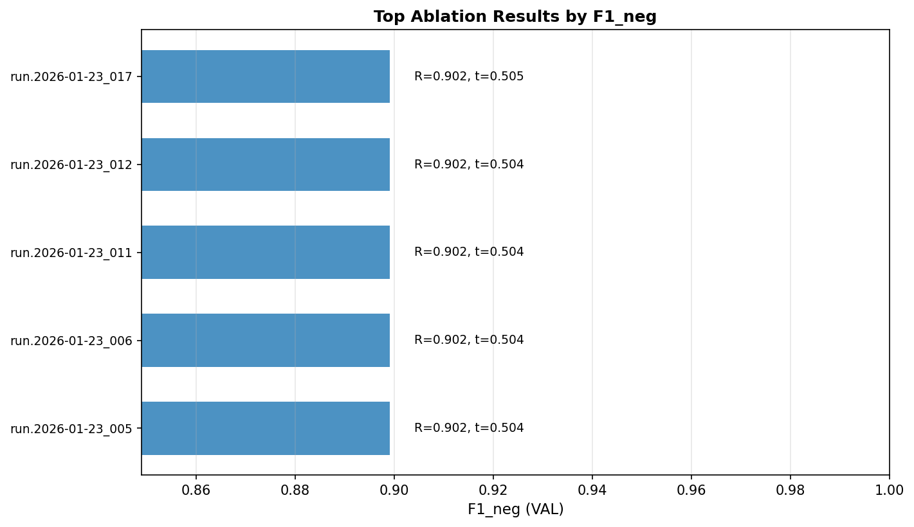

# Layer 2 — Top-K Results & Winner Selection

This report summarizes the most competitive configurations from the **SVC RBF** ablation suite.

## Summary Table

|   Rank | run_id             |   F1_neg |   Recall_neg |   Macro_F1 |   PR_AUC_neg |   Brier_Score |    ECE |   threshold |   C | gamma   |   avg_support_vectors |
|-------:|:-------------------|---------:|-------------:|-----------:|-------------:|--------------:|-------:|------------:|----:|:--------|----------------------:|
|      1 | run.2026-01-23_005 |   0.8991 |       0.9019 |     0.9343 |        0.946 |        0.0372 | 0.0071 |      0.5037 | 0.5 | scale   |                     0 |
|      2 | run.2026-01-23_006 |   0.8991 |       0.9019 |     0.9343 |        0.946 |        0.0372 | 0.0071 |      0.5037 | 0.5 | scale   |                     0 |
|      3 | run.2026-01-23_011 |   0.8991 |       0.9019 |     0.9343 |        0.946 |        0.0372 | 0.0071 |      0.5037 | 0.5 | scale   |                     0 |
|      4 | run.2026-01-23_012 |   0.8991 |       0.9019 |     0.9343 |        0.946 |        0.0372 | 0.0071 |      0.5037 | 0.5 | scale   |                     0 |
|      5 | run.2026-01-23_017 |   0.8991 |       0.9019 |     0.9343 |        0.946 |        0.0372 | 0.007  |      0.5053 | 0.5 | scale   |                     0 |

## Chosen Winner

**Run ID**: `run.2026-01-23_005`

### Winner Configuration

| Parameter | Value |
|-----------|-------|
| Model Type | SVC RBF |
| Kernel | rbf |
| C | 0.5 |
| Gamma | scale |
| Avg SV count | 0 |

### Metric Evidence (VAL)
- **F1_neg**: `0.8991`
- **Recall_neg**: `0.9019`
- **Macro_F1**: `0.9343`

## Decision Evidence

The winner was selected based on the primary objective (Recall_neg ≥ 0.90) and the hierarchy of F1_neg followed by calibration metrics.