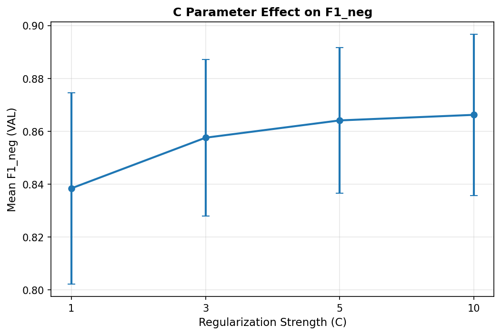
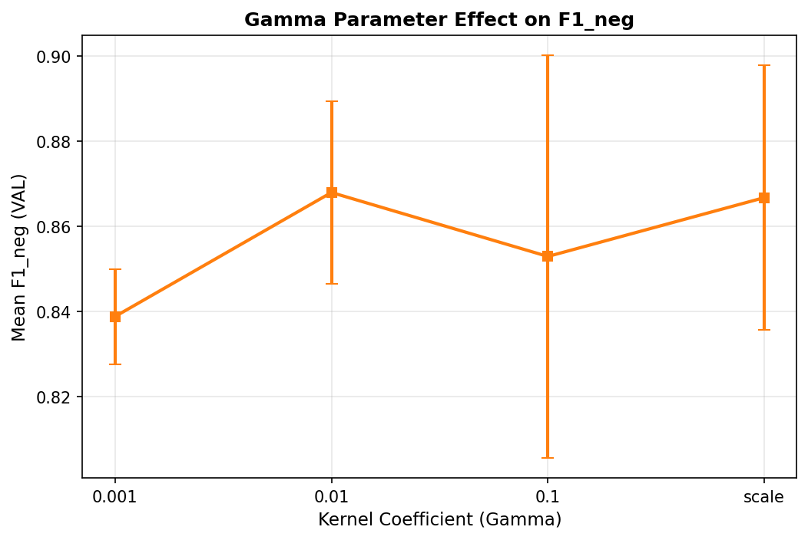
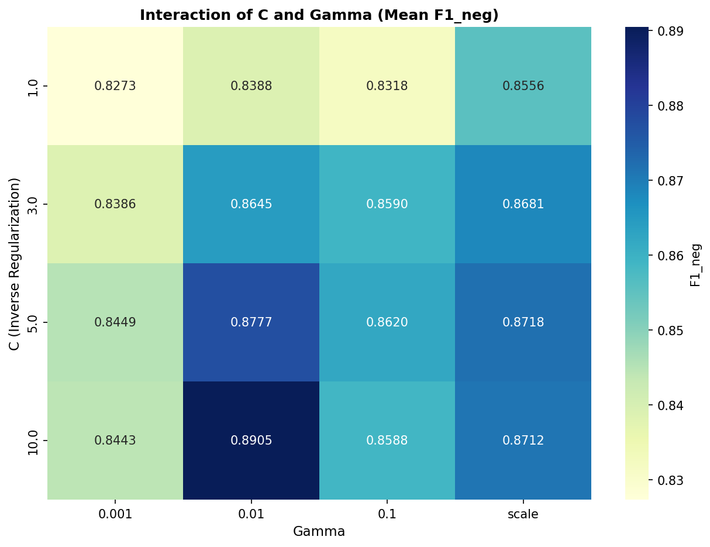
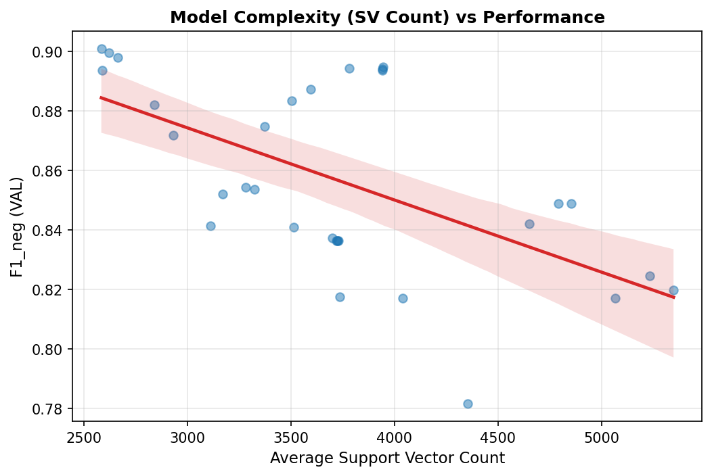
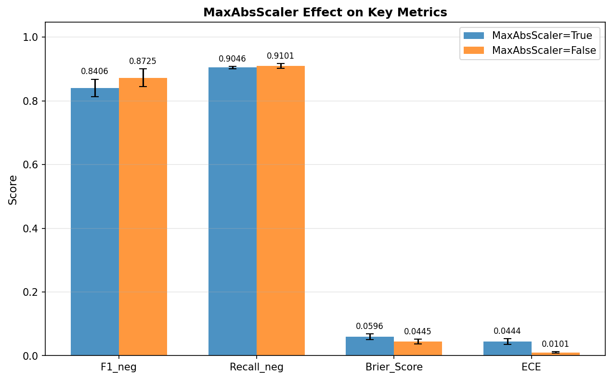
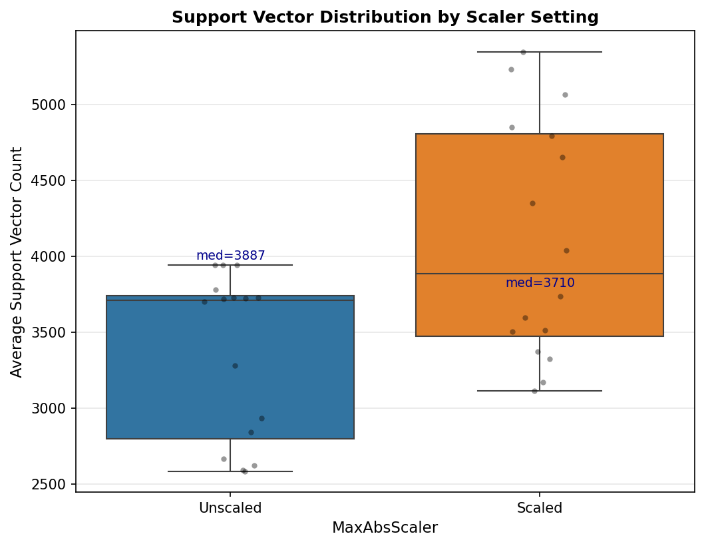
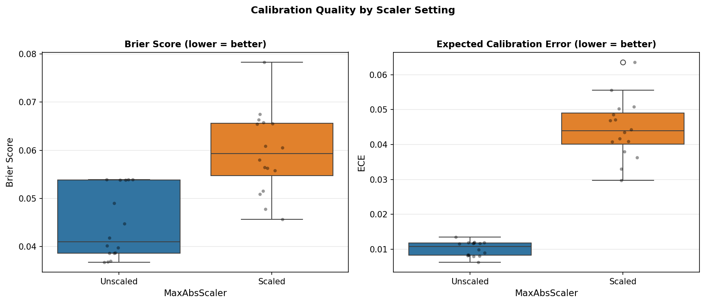

# Layer 3 — Factor-Level Ablation Analysis (SVC RBF)

This layer analyzes how individual design decisions and hyperparameters impact model performance.

## 1. Regularization Strength (C)

The model shows optimal performance around C=10.0. Higher regularization (low C) leads to underfitting, while higher C values show marginal gains or slight volatility depending on other factors.

## 2. Kernel Coefficient (Gamma)

The RBF kernel is most effective with gamma=0.01. This suggests the sentiment features have a specific locality in the feature space that this kernel width captures.

## 3. Gamma & C Interaction

The interaction heatmap reveals a trade-off between C and Gamma. As C increases, the model becomes more sensitive to Gamma choice to avoid over-fitting or complex boundaries.

## 4. Model Complexity (Support Vectors)

There is a negative correlation (r=-0.59) between support vector count and F1_neg. More support vectors generally improve performance until a saturation point is reached.

## 5. MaxAbsScaler Effect on Metrics

Comparison of key metrics between scaled and unscaled pipelines.

## 6. Support Vector Distribution by Scaler

Impact of scaling on support vector count.

## 7. Calibration Quality by Scaler

Comparison of Brier Score and ECE between scaled and unscaled pipelines.