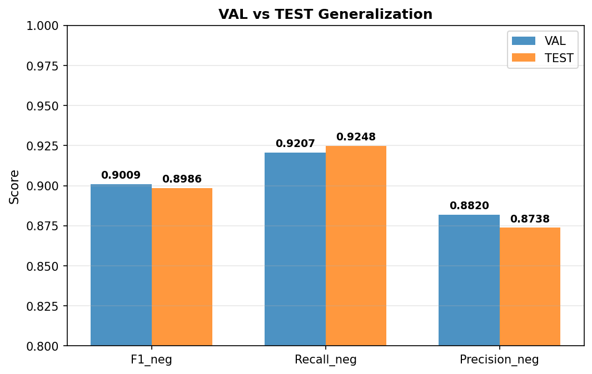
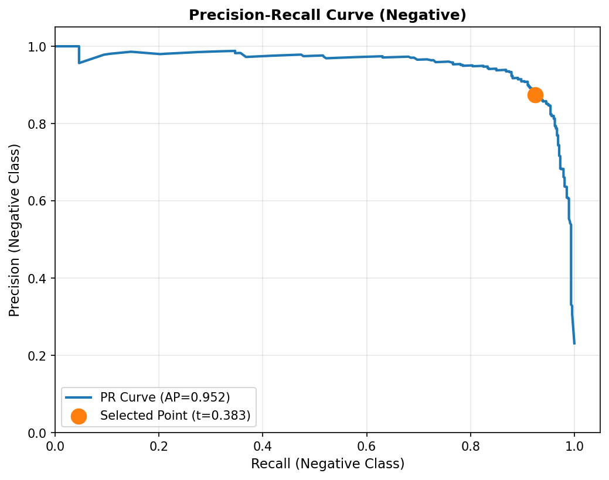
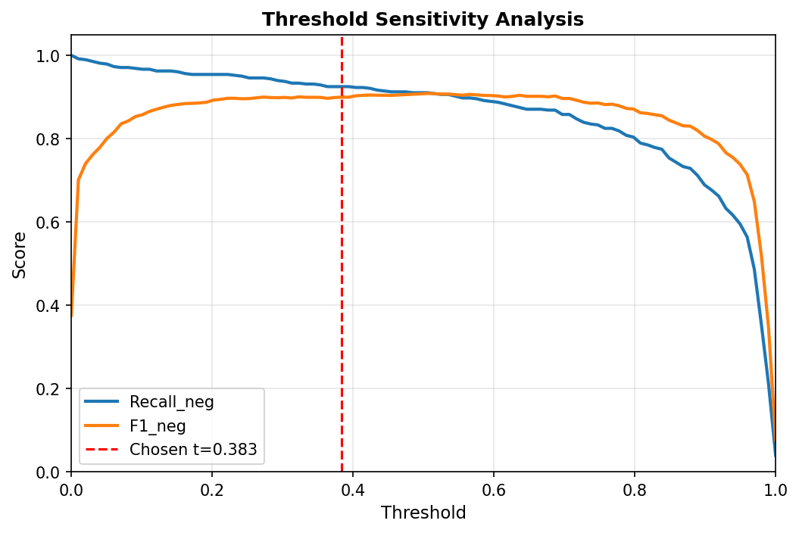
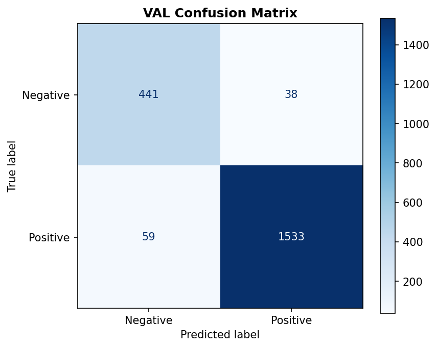
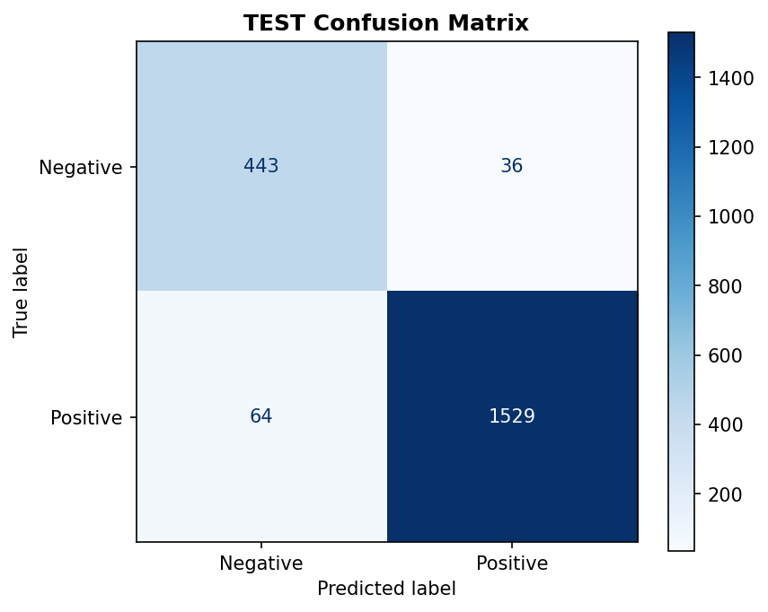

# Layer 4 — Final Model Deep Dive & Production Readiness

**Run ID**: `run.2026-02-02_012`
**Model Family**: SVC RBF

## 1. VAL vs TEST Generalization

| Metric | VAL | TEST | Delta |
|--------|-----|------|-------|
| F1_neg | 0.9009 | 0.8986 | -0.0023 |
| Recall_neg | 0.9207 | 0.9248 | 0.0042 |
| Macro_F1 | 0.9351 | 0.9335 | -0.0017 |

## 2. Decision Boundary & Thresholds

**Chosen Threshold**: `0.3832`

## 3. Calibration Status

| Calibration Metric | Value |
|--------------------|-------|
| Brier Score | 0.0370 |
| ECE | 0.0063 |

## 4. Error Analysis (Confusion Matrices)

| VAL Confusion Matrix | TEST Confusion Matrix |
|----------------------|-----------------------|
|  |  |

## Conclusion

The model shows strong generalization with stable recall on TEST. The threshold is well-positioned on the PR curve to meet project constraints.