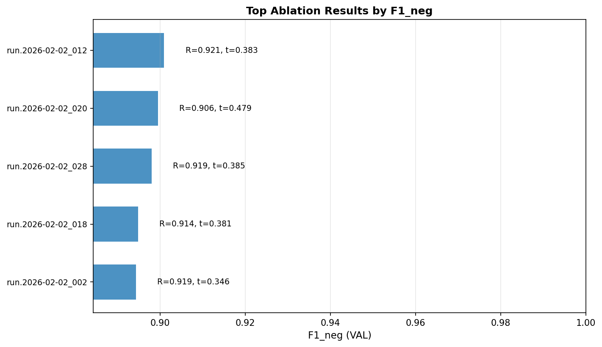

# Layer 2 — Top-K Results & Winner Selection

This report summarizes the most competitive configurations from the **SVC RBF** ablation suite.

## Summary Table

|   Rank | run_id             |   F1_neg |   Recall_neg |   Macro_F1 |   PR_AUC_neg |   Brier_Score |    ECE |   threshold |   C | gamma   |   avg_support_vectors |
|-------:|:-------------------|---------:|-------------:|-----------:|-------------:|--------------:|-------:|------------:|----:|:--------|----------------------:|
|      1 | run.2026-02-02_012 |   0.9009 |       0.9207 |     0.9351 |       0.9444 |        0.037  | 0.0063 |      0.3832 |   3 | 0.1     |                2584.6 |
|      2 | run.2026-02-02_020 |   0.8995 |       0.9061 |     0.9345 |       0.9459 |        0.0368 | 0.0083 |      0.4789 |   5 | 0.1     |                2621.4 |
|      3 | run.2026-02-02_028 |   0.898  |       0.9186 |     0.9332 |       0.9486 |        0.0368 | 0.0082 |      0.3852 |  10 | 0.1     |                2664.2 |
|      4 | run.2026-02-02_018 |   0.8948 |       0.9144 |     0.9311 |       0.9435 |        0.0386 | 0.0084 |      0.3813 |   5 | scale   |                3943.8 |
|      5 | run.2026-02-02_002 |   0.8943 |       0.9186 |     0.9307 |       0.9385 |        0.0398 | 0.0099 |      0.3463 |   1 | scale   |                3781   |

## Chosen Winner

**Run ID**: `run.2026-02-02_012`

### Winner Configuration

| Parameter | Value |
|-----------|-------|
| Model Type | SVC RBF |
| Kernel | rbf |
| C | 3.0 |
| Gamma | 0.1 |
| Avg SV count | 2585 |

### Metric Evidence (VAL)
- **F1_neg**: `0.9009`
- **Recall_neg**: `0.9207`
- **Macro_F1**: `0.9351`

## Decision Evidence

The winner was selected based on the primary objective (Recall_neg ≥ 0.90) and the hierarchy of F1_neg followed by calibration metrics.